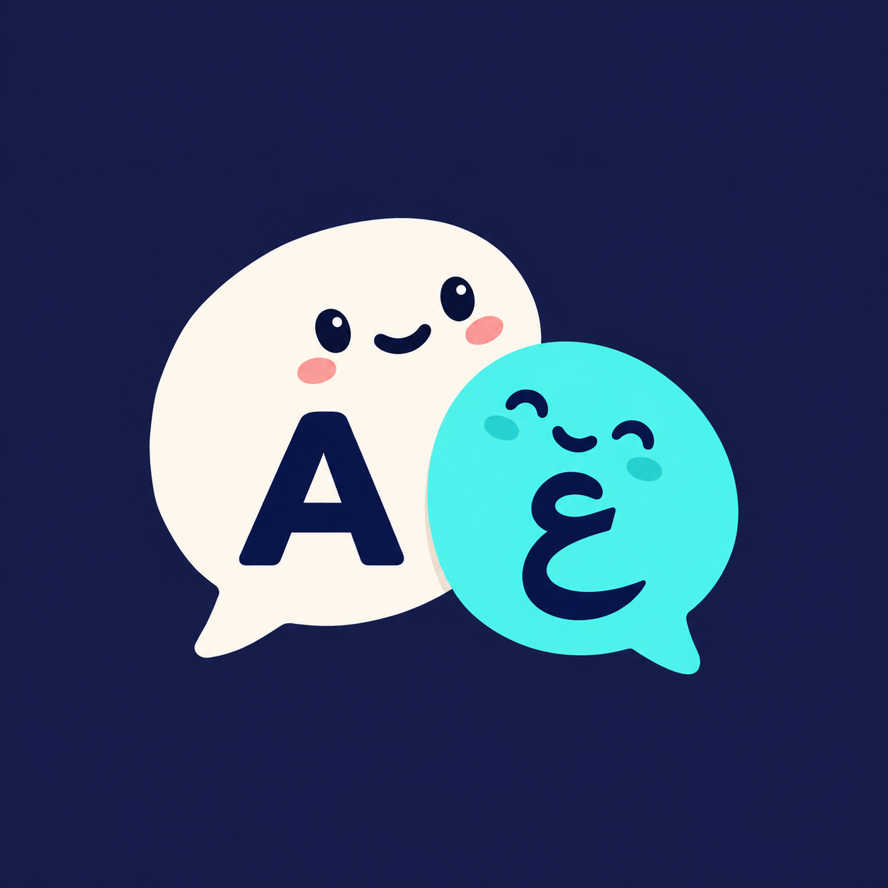
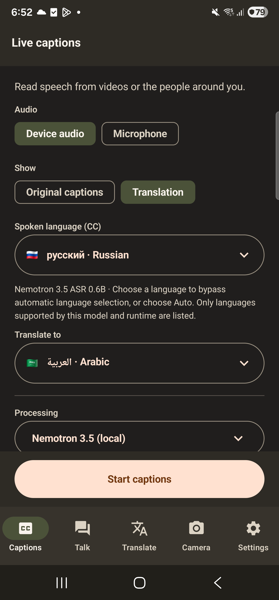
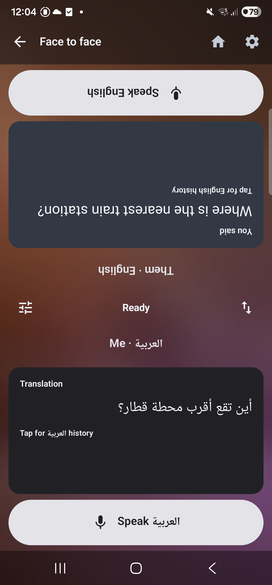
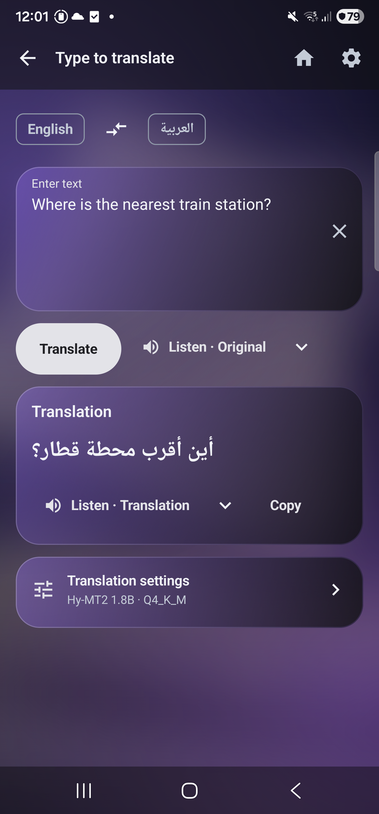
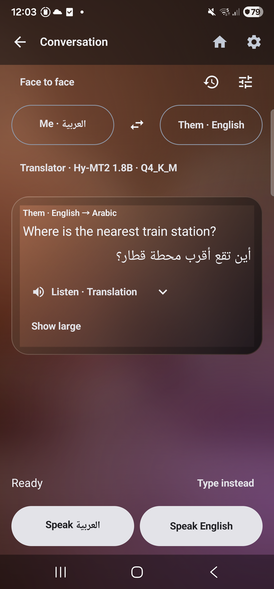
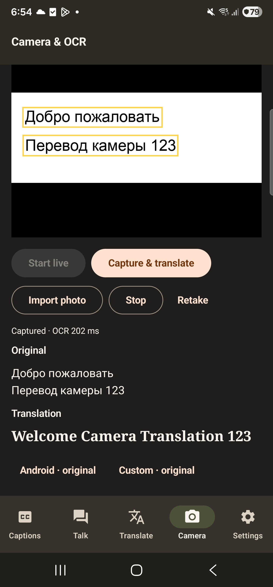
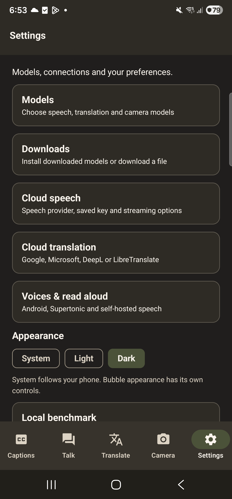

# Hearth



**Offline-first live captions, translation and conversations on Android.**

Hearth helps you read speech, talk across languages, translate text around you and
hear translations aloud. Use compatible models on your phone or connect your own
cloud providers. An image-led home carousel opens each feature directly; the previous five-tab
layout remains available in Appearance & navigation.

> [!IMPORTANT]
> **Experimental proof of concept (PoC) — currently a test project.**
> Hearth is under active development and is not a production-ready release.
> Expect bugs, rough edges and incomplete integrations. Language coverage, accuracy,
> speed and memory use depend on the model, provider and phone. Testing, feedback
> and contributions are welcome; the screenshots show working examples, not a
> guarantee that every model or language pair will work equally well.

## What you can try

- **Browse visual feature cards.** Swipe floating image cards for captions,
  conversation, text, camera and screen translation. Hearth remembers the last
  selected service and each card opens its feature directly. Quick settings
  offers large Local/Cloud setup tiles. Colorful translucent cards and softly blurred
  artwork carry into the feature screens, with Minimal kept as a backup style.
  Feature screens put their main action first,
  with model, voice and timing choices in closeable settings sheets. Choose Clean, Ink, Sky or the original
  Organic theme, with System/Light/Dark modes. New installs default to Ink + Dark. See [navigation and themes](docs/simple-home.md).

- **Start from the notification shade.** Add Live captions and Screen translation
  Quick Settings tiles. Hearth checks setup before requesting capture; missing
  models or connections open actionable diagnostics. See [phone shortcuts](docs/quick-settings.md).
- **Read live captions over other apps.** A movable caption bubble transcribes
  device audio or the microphone, with optional translation and retained text.
- **Have a two-way conversation.** Speak or type in either language, keep originals
  and translations, or use Face to face with a rotated half-screen for each person.
- **Translate what you type or see.** Live typed translation, camera OCR and photo
  import share local or cloud translation options.
- **Listen with your preferred voice.** Play original or translated text using
  Android voices, local Supertonic or supported self-hosted TTS connections.
- **Choose local models or bring your own cloud keys.** Separate Local and Cloud
  settings keep model installation apart from provider connections. Mix speech and translation
  engines, select supported languages, or use the offline flavor with no network permission.
- **Download, import and extend.** Install catalogued models on the phone, choose a
  public download folder, compare installed models and add adapters through Kotlin/JNI.
  See the [model contribution guide](docs/model-contributing.md).

## Screenshots

Hearth 0.11.0 on Android 16, using demo text. Tap an image to view it at full size.
[How these screenshots were captured](docs/screenshots/README.md).

<table>
  <tr>
    <th>Live caption setup</th>
    <th>Face to face</th>
    <th>Type to translate</th>
  </tr>
  <tr>
    <td><a href="docs/screenshots/live-captions.png"></a></td>
    <td><a href="docs/screenshots/face-to-face.png"></a></td>
    <td><a href="docs/screenshots/type-to-translate.png"></a></td>
  </tr>
  <tr>
    <th>Conversation</th>
    <th>Camera &amp; OCR</th>
    <th>Settings</th>
  </tr>
  <tr>
    <td><a href="docs/screenshots/conversation.png"></a></td>
    <td><a href="docs/screenshots/camera-ocr.png"></a></td>
    <td><a href="docs/screenshots/settings.png"></a></td>
  </tr>
</table>

## Five screens, always within reach

| Tab | What you can do |
| --- | --- |
| **Captions** | Start and manage live captions over other apps. |
| **Talk** | Have a conversation or switch to the split **Face to face** view. |
| **Translate** | Type text, read its translation and play either language. |
| **Camera** | Translate live camera text or import a photo for OCR. |
| **Settings** | Choose models, downloads, connections, voices and appearance. |

Each tab remembers its place. Back returns from model/voice setup to the screen
that opened it; tapping the selected tab again returns to its main screen.
The launcher uses the [Arabic/English speech-bubble mascot](docs/brand/README.md).

## Development backlog

See the [model contribution guide](docs/model-contributing.md) and [release checklist](docs/BACKLOG.md) for current release tasks, native integration conventions and model contributions.

## Features

- Movable, resizable caption bubble with retained text, prior lines, selectable
  history, pause/resume, hide/show, recenter and stop notification controls.
- Capture another app's playback audio or the microphone. Android asks for consent
  each session. Apps can block playback capture; protected streams may be silent.
- Local Whisper, Vosk, Qwen3-ASR, Nemotron and English Moonshine runtimes, with verified model imports.
- Optional local translation using ML Kit language packs (play only), TranslateGemma
  4B, or the existing HY-MT1.5/Hy-MT2 quantizations. Explicit CC languages and translation directions;
  bounded background translation, live toggle, and per-line timing.
  See [local translation setup](docs/local-translation.md).
- Cloud STT and real-time Arabic/English translation with your own provider keys.
  Soniox v5 adds original and translated text; Scribe v2 adds another STT choice.
  Speech-only model filtering, provider configuration, and encrypted key storage.
- Direct HTTPS file downloads with foreground progress, cancellation, selectable public folder,
  and automatic installation of catalogued speech/translation models. New downloads use
  `Downloads/Hearth/models` or `files` on Android 10+. This does not include a video-site extractor.
- A local-only `foss` variant with **no network permission**, and a network-enabled
  `play` variant. ML Kit is an optional Google SDK in the play flavor; foss excludes it.

- Two-way **Conversation** with a quick language swap, microphone or typed turns, originals and translations, local history and optional offline TTS. **Face to face**, in the **Talk** tab alongside Conversation, gives each person a half-screen and large Speak button, with the upper half rotated. Translation can use an installed model or Google Cloud, Microsoft Azure, DeepL or LibreTranslate. See [conversation scope](docs/conversation-mode-plan.md) and [translation connections](docs/conversation-cloud-translation.md).
- **Local benchmark** compares installed models on the same WAV or corrected text, separates loading from inference and saves/export reports on-device. See [method and limitations](docs/local-benchmark.md), [speech phone results](docs/validation-v17.md), and the [eight-option local translation comparison](docs/local-translation-benchmark-2026-09-13.md).
- Persistent System, Light and Dark appearance in Settings.

- **Camera translate**: live camera and photo text recognition with PaddleOCR v5 mobile, selectable local/cloud text translation, and automatic model installation. See [camera setup, sources and limits](docs/camera-ocr.md).
- **Manga reading (experimental)**: native Manga OCR and Meiki options, verified model downloads, and drawing around text on captured/imported pages. Reuses translation and read-aloud providers. Cross-app capture supports manual and settled page-change translation. See [setup and current limits](docs/screen-reading.md).

- **Type to translate**: type above a live translation, swap languages, copy and play either text.
- **Shared read-aloud**: installed Android voices or local Supertonic 3 (31 languages including Arabic, ten voices). Optional self-hosted Chatterbox, Qwen3-TTS and Fish Speech adapters in play. Used by traveler modes, typed translation, camera and captions. See [voice downloads, server setup and capability limits](docs/voices.md).

## Build

Android 9+ (API 28); **arm64 only**. Playback capture requires Android 10+.
Use JDK 17, Android SDK 36, NDK 27.0.12077973 and SDK CMake 3.22.1. Set ANDROID_HOME
or create an ignored `local.properties` with `sdk.dir=/your/android/sdk`.
The Gradle wrapper, required Whisper source subset, and speech runtime binaries are
included. No Hearth checkout or local Maven repository is needed.

```sh
./gradlew test :app:compilePlayQaKotlin :app:compileFossQaKotlin
bash common-jni/src/main/cpp/common/tests/run_common_utils_tests.sh
bash common-jni/src/main/cpp/speech/tests/run_speech_tests.sh
bash common-jni/src/main/cpp/vosk/tests/run_vosk_api_tests.sh
bash common-jni/src/main/cpp/ocr/tests/run_ocr_tests.sh
bash common-jni/src/main/cpp/voice/tests/run_voice_tests.sh
python3 -m unittest discover -s scripts/voice -p 'test_*.py'
python3 scripts/speech/test_package.py
./gradlew :common-jni:externalNativeBuildDebug :app:assemblePlayQa :app:assembleFossQa
python3 scripts/verify-release.py
```

APKs: `app/build/outputs/apk/{play,foss}/qa/`. QA builds use the standard Android
**debug signing key** and application ID `com.sal7one.transiber.qa`. They are test
artifacts, not a stable signing identity for store releases. For a production
release, build the unsigned release variant and sign it with your own key outside
Git; see the [release and signing guide](docs/releasing.md).
Never commit keys or credentials. CI builds and uploads both QA APKs.
See [changes](CHANGELOG.md), [security reporting](SECURITY.md), and the
[publication audit](docs/publication-audit.md).

## Start captions

1. In **Captions**, choose Device audio or Microphone, original captions or
   translation, and your language. Your last setup is remembered.
2. Tap **Start captions**. Android asks for any required permissions or device-audio
   consent; the app does not ask you to choose the audio source again.
3. While running, **Show captions** recovers the bubble and **Stop** ends capture.
   Bubble settings separate Appearance from CC & translation.

**Settings** contains Models, Downloads, Cloud speech, Cloud translation and Voices & read aloud. Models groups Speech,
Translation, Camera, Voices and Cloud, with source links, installed models and matching import actions.
Speech and translation family chips open the matching setup directly; the active
model is labeled separately. Translation sizes are grouped by family. See [all sources and installation paths](docs/model-sources.md). Connect
or change your existing cloud provider/key under Settings → Cloud speech. Advanced setup
retains the detailed engine controls and live cloud presets.

Local Qwen and Nemotron recognize speech. The optional local text-model bridge
translates their output with a separately selected translator. Whisper can
translate to English. Local Marian translation requires a compatible installed
language-pair bundle. Recognition accuracy, language coverage, capture eligibility
and latency depend on the model, device and source. This app does not recognize
sign language. See [model setup](docs/models.md), [language pickers and extension guide](docs/language-pickers.md), and [device checks](docs/device-checks.md).

## Privacy and project scope

See [PRIVACY.md](PRIVACY.md). This standalone app has a separate Android identity from the original media-suite Hearth. Existing standalone Transiber installations upgrade in place to the Hearth name, retaining saved keys, models and settings. Data from the media-suite app is not transferred automatically. Uninstalling deletes app-private data and installed
models. New public Downloads files remain; export older app-stored downloads or
Android 9 downloads first if you need to keep them.

The repo has fresh history and excludes Hearth's editor, FFmpeg, books, sign
recognition, yt-dlp, chat and unrelated screens. Camera/image OCR translation is included. Shared utilities and speech
JNI APIs retain their original packages where required for native binding compatibility.

## License

First-party code: Apache-2.0. Bundled third-party code and runtime libraries retain
their own terms; see [THIRD_PARTY_NOTICES.md](THIRD_PARTY_NOTICES.md).
Model weights are separately licensed downloads, not bundled app assets.

### Model downloads

In Models, **Download & install** downloads catalogued Moonshine Tiny/Base,
Qwen3-ASR 0.6B, Nemotron, translation GGUFs and PaddleOCR ONNX files, then verifies and installs them
on the phone. No computer, export or re-import is required. Use the installed
model when ready; a background completion does not replace a running session's engine.

Original downloads live in **Downloads/Hearth/models** (direct URLs
in `files`). **Downloads → Choose folder** selects another writable folder for
future downloads, including on Android 9. Installed engines keep a separate,
verified app-owned copy. Downloads can be deleted without uninstalling models.
ML Kit packs remain managed by Google's SDK. The offline APK has no downloader.

Custom model packaging is an extension/developer path documented in
[model contributing](docs/model-contributing.md), not a prerequisite for catalog downloads.

### Screen reading (0.14.0 development build)

Camera → **Open reading overlay** translates manga and books in another app. Draw around a bubble, translate manually, or refresh after a settled page change. Original text, session history and read aloud reuse Hearth’s existing local/cloud engines. Paddle, Manga OCR and Meiki have been run on an Android phone. This remains experimental. Translations appear over text in the live reader. A separate lock handle enables scrolling through the transparent layer; visual movement clears old placements and refreshes translation after settling. Unlock boxes for full text/read aloud. This is experimental, without artwork inpainting or frame-perfect scroll tracking. [Setup, limitations and tests](docs/screen-reading.md).

The 0.13.1 build removes the optional Accessibility service after a Play Protect
installation block was reported. Reading uses explicit screen-sharing consent;
scroll-count/distance and Volume Up shortcuts are no longer offered.
[Installation validation and limitations](docs/validation-v27.md).

### Shared translation choices (0.15.0 development build)

The same **Translator** chooser now appears across captions, typed text, conversation, camera and screen reading. Browse installed/downloadable local models or Google, Microsoft, DeepL and LibreTranslate connections; **Use across Hearth** applies one choice everywhere. Captions can reuse these text translators after recognition. [Choices, privacy and routing](docs/translation-choices.md).
