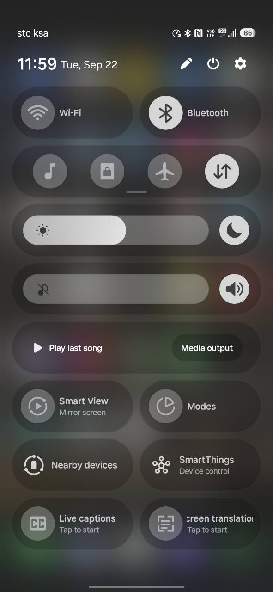
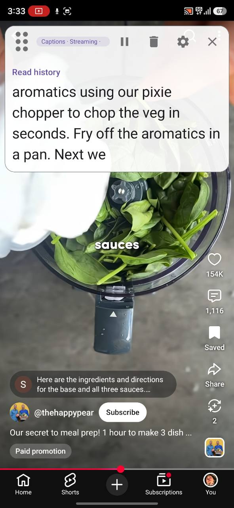
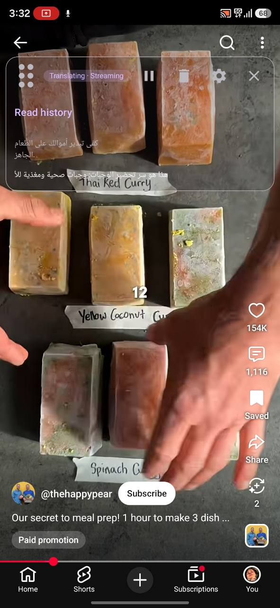
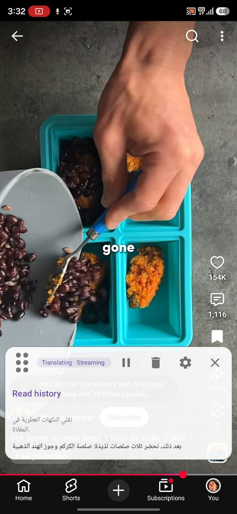
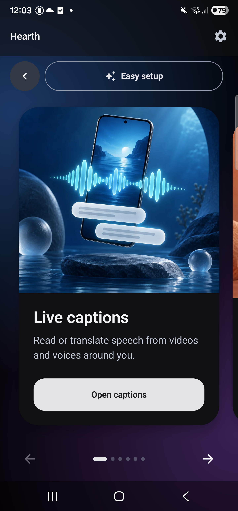
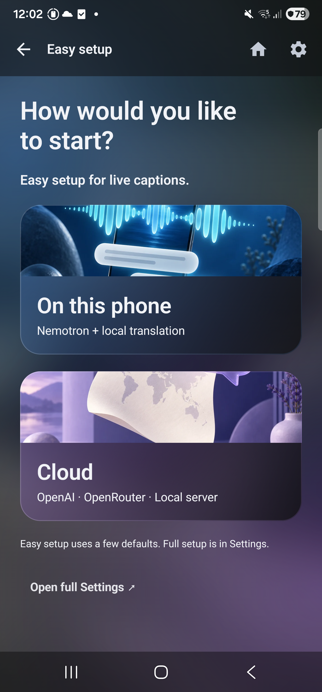
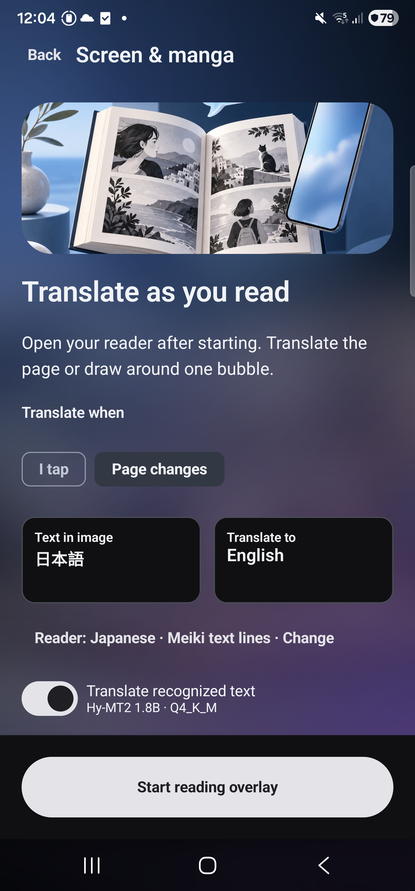

# Hearth


**Read speech. Translate your screen. Talk across languages.**

An offline-first Android app for live captions, translation and conversations.
Use models on your phone, bring your own cloud keys, or mix both. Built to make
speech and languages more accessible, including for deaf and hard-of-hearing users.

[Download](#download) · [Screenshots](#screenshots) · [Quick start](#quick-start) · [Models](#models-and-connections) · [Build](#build)

> [!IMPORTANT]
> **Experimental proof of concept — actively developed, not production-ready.**
> Expect bugs and incomplete integrations. Accuracy, language coverage and speed
> depend on your model, provider and phone. Feedback and contributions are welcome.

## Screenshots

Real use shared by the project owner: Quick Settings access, English live captions,
and Arabic translation over another app. Tap an image to see it full size.

<table>
  <tr><th>Start from Quick Settings</th><th>Read live captions</th></tr>
  <tr>
    <td><a href="docs/screenshots/quick-settings.jpg"></a></td>
    <td><a href="docs/screenshots/live-caption-overlay.jpg"></a></td>
  </tr>
  <tr><th>Translate with a transparent bubble</th><th>Move the bubble where you want</th></tr>
  <tr>
    <td><a href="docs/screenshots/translation-overlay-transparent.jpg"></a></td>
    <td><a href="docs/screenshots/translation-overlay-bottom.jpg"></a></td>
  </tr>
</table>

The video examples show @thehappypear in YouTube; third-party content belongs to
its respective owners. [Screenshot details](docs/screenshots/README.md).

<details>
<summary><strong>Explore the app: Home, setup, conversation, camera and more</strong></summary>

Hearth 0.22.1 on Android 16. Conversation and OCR examples use synthetic text.

<table>
  <tr>
    <th>Home cards</th>
    <th>Easy setup</th>
    <th>Live captions</th>
  </tr>
  <tr>
    <td><a href="docs/screenshots/home.png"></a></td>
    <td><a href="docs/screenshots/easy-setup.png"></a></td>
    <td><a href="docs/screenshots/live-captions.png"></a></td>
  </tr>
  <tr>
    <th>Conversation</th>
    <th>Face to face</th>
    <th>Type to translate</th>
  </tr>
  <tr>
    <td><a href="docs/screenshots/conversation.png"></a></td>
    <td><a href="docs/screenshots/face-to-face.png"></a></td>
    <td><a href="docs/screenshots/type-to-translate.png"></a></td>
  </tr>
  <tr>
    <th>Camera &amp; OCR</th>
    <th>Screen &amp; manga</th>
    <th>Settings</th>
  </tr>
  <tr>
    <td><a href="docs/screenshots/camera-ocr.png"></a></td>
    <td><a href="docs/screenshots/screen-reading.png"></a></td>
    <td><a href="docs/screenshots/settings.png"></a></td>
  </tr>
</table>

</details>

## Download

**[Hearth 0.22.3 — release notes and checksums](https://github.com/Sal7one/Hearth/releases/tag/v0.22.3)**

| Build | Download | Includes |
| --- | --- | --- |
| **Cloud + local** | [ARM64 APK](https://github.com/Sal7one/Hearth/releases/download/v0.22.3/hearth-0.22.3-cloud-qa-arm64.apk) | On-device models, optional cloud connections and model downloads. |
| **Offline only** | [ARM64 APK](https://github.com/Sal7one/Hearth/releases/download/v0.22.3/hearth-0.22.3-offline-qa-arm64.apk) | Local models imported from files. **No network permission.** |

Android 9+; device-audio capture requires Android 10+. These are test-signed preview
builds. Both flavors use the same app identity and replace each other. **Update
without uninstalling** to keep your models, keys, settings and history.

Version 0.22.3 fixes cloud translation selection, remembers separate translator
choices across feature groups, and waits for model cleanup when switching overlays.
See the [changelog](CHANGELOG.md) and [pipeline audit](docs/pipeline-ownership.md).

## What you can do

| Feature | What it does |
| --- | --- |
| **Live captions** | Read device audio or microphone speech over other apps, with optional translation. Move or resize the bubble, change transparency, scroll history, pause or clear text. Touch pass-through has a separate recovery handle; notifications provide session controls. |
| **Screen & manga** | Translate text over a shared screen, draw around a region, or refresh after a settled page change. A lock handle lets you scroll the app underneath. Experimental; no artwork inpainting or frame-perfect tracking. |
| **Conversation / Face to face** | Speak or type in two languages, swap them quickly, keep originals and translations, and hear text aloud. Face to face rotates one half of the screen for the other person. |
| **Type to translate** | Type above a live translation, copy either text and play it aloud. |
| **Camera & OCR** | Recognize and translate camera or imported-photo text with local OCR and your chosen translator. |
| **Read aloud** | Use Android voices, local Supertonic, or supported self-hosted TTS across Hearth. |

Swipe the illustrated Home cards to open a feature; Hearth remembers your last
choice. The interface supports **English, العربية and 简体中文**, with RTL for Arabic.
Ink + Dark is the default; other themes, appearance controls and Classic tabs are
available in Settings. Speech and translation languages follow the selected engine’s
capabilities and are independent of the interface language.

## Quick start

1. Open **Easy setup** from Home or Settings. Choose **On this phone** for Nemotron
   speech + Hy-MT2 translation, or **Cloud** for OpenAI, OpenRouter or a compatible
   HTTPS local server. The offline build uses model imports.
2. Open a feature and choose your languages. For live captions, select **Device
   audio** or **Microphone**, then original captions or translation.
3. Tap the start button and accept Android’s required permissions or capture prompt.

OpenAI Easy setup starts with live translation; OpenRouter and local servers start
with speech captions. Full model and provider choices are in Settings, separated
into **Local** and **Cloud**. [Easy setup guide](docs/easy-setup.md).

### Quick access without opening Home

Open **Settings → Phone shortcuts** and add **Live captions** and **Screen
translation** to Android Quick Settings. You can also edit the tiles in your
notification shade and drag them into place.

- **Tap to start:** uses your saved setup, checks readiness, then requests capture consent.
- **Tap to show:** brings back controls for an overlay that is already running.
- **Setup missing:** opens diagnostics with the actual problem and links to fix it.

Android’s capture consent still applies; apps may block audio or screen capture.
[Shortcut setup and behavior](docs/quick-settings.md).

## Models and connections

| Task | Available options |
| --- | --- |
| **Local speech** | Whisper, Vosk, Qwen3-ASR, Nemotron and English Moonshine. |
| **Local translation** | HY-MT1.5 / Hy-MT2, TranslateGemma 4B, compatible Marian language-pair bundles, and optional ML Kit packs in the cloud-capable build. |
| **Cloud speech** | Bring your own provider keys, including OpenAI, Soniox and ElevenLabs Scribe. Translation support depends on the connection. |
| **Cloud text translation** | Shared translator choices include Google Cloud, Microsoft Azure, DeepL and LibreTranslate connections. |
| **Local OCR** | PaddleOCR, Manga OCR and Meiki; choose a reader that supports your source language. |
| **Read aloud** | Android voices, local Supertonic 3, or self-hosted Chatterbox, Qwen3-TTS and Fish Speech connections in the cloud-capable build. |

Local Qwen and Nemotron recognize speech; a separate translator handles translated
captions. Whisper’s built-in translation targets English. Translator choices are
remembered by feature group; **Use everywhere** explicitly applies one across Hearth.
Keys are stored encrypted. [Translation routing](docs/translation-choices.md).

Use **Download & install** for catalogued models—no computer, export or re-import.
Original downloads go to **Downloads/Hearth/models** (direct files to `files`), or
choose a different public folder in Downloads. Installed models keep a separate
verified app-owned copy. ML Kit manages its own packs; the offline build has no
downloader.

- [Model sources and download links](docs/model-sources.md) · [Speech setup](docs/models.md)
- [Local translation](docs/local-translation.md) · [Cloud text translation](docs/conversation-cloud-translation.md)
- [Camera OCR](docs/camera-ocr.md) · [Screen & manga](docs/screen-reading.md) · [Voices](docs/voices.md)
- [Compare installed models](docs/local-benchmark.md) · [Recorded translation comparison](docs/local-translation-benchmark-2026-09-13.md)

## Build

Android 9+ (API 28); **arm64 only**. Playback capture requires Android 10+.
Use JDK 17, Android SDK 36, NDK 27.0.12077973 and SDK CMake 3.22.1. Set ANDROID_HOME
or create an ignored `local.properties` with `sdk.dir=/your/android/sdk`.
The Gradle wrapper, required Whisper source subset, and speech runtime binaries are
included. No Hearth checkout or local Maven repository is needed.

```sh
./gradlew test :app:compilePlayQaKotlin :app:compileFossQaKotlin
bash common-jni/src/main/cpp/common/tests/run_common_utils_tests.sh
bash common-jni/src/main/cpp/speech/tests/run_speech_tests.sh
bash common-jni/src/main/cpp/vosk/tests/run_vosk_api_tests.sh
bash common-jni/src/main/cpp/ocr/tests/run_ocr_tests.sh
bash common-jni/src/main/cpp/voice/tests/run_voice_tests.sh
python3 -m unittest discover -s scripts/voice -p 'test_*.py'
python3 scripts/speech/test_package.py
./gradlew :common-jni:externalNativeBuildDebug :app:assemblePlayQa :app:assembleFossQa
python3 scripts/verify-release.py
```

APKs: `app/build/outputs/apk/{play,foss}/qa/`. QA builds use the standard Android
**debug signing key** and application ID `com.sal7one.transiber.qa`. They are test
artifacts, not a stable signing identity for store releases. For a production
release, build the unsigned release variant and sign it with your own key outside
Git; see the [release and signing guide](docs/releasing.md).
Never commit keys or credentials. CI builds and uploads both QA APKs.
See [changes](CHANGELOG.md), [security reporting](SECURITY.md), and the
[publication audit](docs/publication-audit.md).

## Contribute

Bug reports, device feedback, translations and model adapters are welcome.
[Open an issue](https://github.com/Sal7one/Hearth/issues) with the app version, phone,
selected engines and the actual error. Remove API keys and private text from logs.

Start with the [model contribution guide](docs/model-contributing.md),
[language capability guide](docs/language-pickers.md), [localization guide](docs/localization.md)
and [release backlog](docs/BACKLOG.md). Kotlin/JNI adapters reuse shared pipelines;
models have explicit capabilities and verified installation paths.

## Privacy and scope

Local models run on your phone; cloud connections send the relevant input to the
provider you choose. The offline flavor has no network permission.
Read the [privacy policy](PRIVACY.md) and [security reporting guide](SECURITY.md).

This is the standalone caption/translation app, separate from the original Hearth
media suite. Existing standalone Transiber installs upgrade in place to Hearth;
data from the media suite is not transferred automatically. Uninstalling removes
app-private models and data; files in public Downloads remain.

This repository excludes the media editor, FFmpeg, yt-dlp and sign recognition.
Native binding packages retain their original names for compatibility.

## License

First-party code: **Apache-2.0**. Third-party runtimes and model weights have their
own terms; see [THIRD_PARTY_NOTICES.md](THIRD_PARTY_NOTICES.md). Model weights are
separate downloads. Third-party content visible in screenshots is not part of
Hearth’s code or artwork license.
