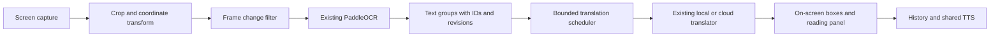

# Screen translation overlay research

Research date: 19 September 2026. Hearth source inspected at `5c18f6c`.

## Recommendation

Add **Screen translation** within Hearth's existing Camera area, with three actions: **Translate screen**, **Select area**, and **Watch area**. Reuse the existing PaddleOCR, translation providers, model installation, language capabilities and TTS. Build a screen capture adapter and a block-based translation presentation layer around them.

The most useful Android references are **ciddwd/overlay-translator** for capture scheduling and changing text, and **AidanPark/screen-translator** for pointer/selection interactions. **PlayTranslate** is particularly interesting for readable result panels, geometry and gaming workflows. These are source references, not evidence that any implementation is faster or more reliable on our phone.

This review inspected Play listings and four promotional screenshots, cloned four Android projects, and read selected capture, OCR, translation and overlay sources. It did not install those apps, execute their builds, benchmark them, or verify their marketing claims. Research clones and downloaded screenshots remain under the git-ignored `research/screen-overlay-review-2026-09-19/` directory. No third-party implementation has been copied into Hearth.

## The two requested apps

| App | Advertised workflow | Useful product lesson |
| --- | --- | --- |
| [Instant Translate On Screen — Sapiens Labs](https://play.google.com/store/apps/details?id=com.spaceship.screen.textcopy) | Drag a bubble to text; full-screen, selected-region and automatic translation; comic/vertical-text mode; camera/gallery; word lookup and history. The listing advertises offline translation and local recognition. | One floating entry point with distinct quick actions. Its promotional images show both a readable translation card and text replaced inside comic bubbles. |
| [Translate On Screen — EZ Screen Translator](https://play.google.com/store/apps/details?id=com.recognize_text.translate.screen) | Floating screen translation for games, chats, shopping, social posts and comics; copying recognized/translated text; image, camera and voice translation. | Put translations near the source and let users continue using the underlying app. Its promotional screenshots show translated blocks over a page and game dialogue. |

Both listings include ads and in-app purchases. Neither listing establishes the exact OCR runtime, model artifacts, supported OCR scripts, sustained latency or full offline language-pair matrix. Source availability was not established for either app. Use their interaction ideas; do not describe their runtime or privacy properties as independently audited.

The listings' large translation-language counts must not become our OCR capability claims. Standard [ML Kit Text Recognition v2](https://developers.google.com/ml-kit/vision/text-recognition/v2/languages) covers Latin and selected Asian scripts; its published list does not include Arabic or Russian/Cyrillic recognition. Hearth already has separate Arabic and Cyrillic PaddleOCR profiles, which should remain central.

## Open-source shortlist

### 1. ciddwd/overlay-translator — strongest capture/pipeline reference

[Repository](https://github.com/ciddwd/overlay-translator) · [English guide](https://github.com/ciddwd/overlay-translator/blob/2e4e692f1736fdb6479d761833c508ea3fa208e5/README.en.md) · [Apache-2.0 license](https://github.com/ciddwd/overlay-translator/blob/2e4e692f1736fdb6479d761833c508ea3fa208e5/LICENSE)

Inspected revision: `2e4e692f1736fdb6479d761833c508ea3fa208e5` (13 September 2026).

Its source separates screenshot backends, region geometry and stability policies. The service actually invokes frame/text stability decisions and translation-batch invalidation, rather than merely declaring those abstractions. Capture is serialized, obsolete work is rejected, and loop mode can wait for settled text. These are directly relevant to subtitles, typewriter game dialogue and scrolling pages. See [CaptureService](https://github.com/ciddwd/overlay-translator/blob/2e4e692f1736fdb6479d761833c508ea3fa208e5/app/src/main/java/com/gameocr/app/service/CaptureService.kt) and [LoopFrameStabilityPolicy](https://github.com/ciddwd/overlay-translator/blob/2e4e692f1736fdb6479d761833c508ea3fa208e5/app/src/main/java/com/gameocr/app/capture/LoopFrameStabilityPolicy.kt).

Its [MediaProjectionScreenshotter](https://github.com/ciddwd/overlay-translator/blob/2e4e692f1736fdb6479d761833c508ea3fa208e5/app/src/main/java/com/gameocr/app/capture/MediaProjectionScreenshotter.kt) handles capture resize and image ownership. The surrounding service explicitly prepares/hides or masks its own UI during capture. This is a useful reference for preventing a translation overlay from reading itself.

Adopt small, reviewed policies where appropriate, preserving notices. Do not transplant the whole service: it is 5,552 lines at this revision and includes many features outside our first release. Shizuku, cloud OCR and local LLM options should not become mandatory setup steps.

### 2. AidanPark/screen-translator — strongest simple interaction reference

[Repository](https://github.com/AidanPark/screen-translator) · [Apache-2.0 license](https://github.com/AidanPark/screen-translator/blob/1599f1db6d5d54ca1ef04e028ce3bd5449c2b175/LICENSE)

Inspected revision: `1599f1db6d5d54ca1ef04e028ce3bd5449c2b175` (19 September 2026).

The app implements word, sentence, paragraph and rectangular selection around a draggable pointer. It has a distinct target-handle state machine and capture epochs to reject old results. Useful source: [TargetHandleViewModel](https://github.com/AidanPark/screen-translator/blob/1599f1db6d5d54ca1ef04e028ce3bd5449c2b175/app/src/main/java/com/galaxy/airviewdictionary/ui/screen/overlay/targethandle/TargetHandleViewModel.kt).

Its [CaptureRepository](https://github.com/AidanPark/screen-translator/blob/1599f1db6d5d54ca1ef04e028ce3bd5449c2b175/app/src/main/java/com/galaxy/airviewdictionary/data/local/capture/CaptureRepository.kt) retains a projection/display during a session, detaches the surface while idle, times out frame waits and invalidates stopped tokens. Those lifecycle ideas are useful, but the implementation still deserves independent review; for example, its density input uses `density.toInt()` where Android's display API expects density DPI.

Do not copy its default translation route as our Google Cloud provider. [GoogleWebService](https://github.com/AidanPark/screen-translator/blob/1599f1db6d5d54ca1ef04e028ce3bd5449c2b175/app/src/main/java/com/galaxy/airviewdictionary/data/remote/translation/goolge/GoogleJsService.kt) calls a web translation endpoint. Hearth already has explicit provider contracts. Its ML Kit OCR path is also not a replacement for our Arabic/Cyrillic models.

### 3. dominostars/playtranslate — strongest advanced UX reference

[Repository](https://github.com/dominostars/playtranslate) · [GPL-3.0 license text](https://github.com/dominostars/playtranslate/blob/cfaaca6e76df66402f07e7555d04b1372a9cd1db/LICENSE)

Inspected revision: `cfaaca6e76df66402f07e7555d04b1372a9cd1db` (18 September 2026, commit timezone).

The source includes separate MediaProjection/accessibility capture backends, OCR grouping, RTL geometry, translation history and downloadable offline translation integrations. Its [CaptureResultGeometry](https://github.com/dominostars/playtranslate/blob/cfaaca6e76df66402f07e7555d04b1372a9cd1db/app/src/main/java/com/playtranslate/ui/CaptureResultGeometry.kt) explicitly remembers the user's chosen panel size, clamps height and chooses stacked versus side-by-side layouts. This addresses several problems Hearth's owner has already encountered.

There are focused tests for capture teardown, RTL positioning, overlay masks and result geometry. They were inspected as coverage leads, not run or independently validated. Favor these user-visible ideas over importing its much larger dictionaries/Anki/gaming feature set.

### 4. longipinnatus/ScreenTrans — smaller PaddleOCR reference

[Repository](https://github.com/longipinnatus/ScreenTrans) · [GPL-3.0 license text](https://github.com/longipinnatus/ScreenTrans/blob/769cafd48a1cd207ede78ec12b1c8e158876ee44/LICENSE)

Inspected revision: `769cafd48a1cd207ede78ec12b1c8e158876ee44` (1 June 2026).

Its Kotlin [OcrEngine](https://github.com/longipinnatus/ScreenTrans/blob/769cafd48a1cd207ede78ec12b1c8e158876ee44/app/src/main/kotlin/com/longipinnatus/screentrans/OcrEngine.kt) uses ONNX Runtime directly. The implementation includes region crops, vertical-text handling and foreground/background color estimation. Its translation path associates responses with block IDs, and the overlay uses Android text layout to fit translated text.

Useful for understanding the complete small-app flow. The project itself describes an early-stage implementation. Its streaming translation parser uses incremental JSON matching and fallback parsing; Hearth should keep strict result identity and error handling instead of inheriting that parser without validation.

### Additional references worth retaining

- [DavidVentura/offline-translator](https://github.com/DavidVentura/offline-translator): Android offline image/text/document translation using Firefox translation packs, PaddleOCR and native inference. It also documents an AIDL translation service. This is a useful follow-up for compact translation packs or optional inter-app translation, although the service contract, supported pairs and compatibility would need a separate review. Root app license: GPL-3.0. Documentation review only in this session.
- [Translumo](https://github.com/ramjke/Translumo): Apache-2.0 Windows screen translator. Useful for the narrow capture-region workflow and separating OCR from translation. Its Windows OCR/DirectX/.NET deployment is not an Android library. Documentation review only; no claim that combining its OCR engines would improve phone performance.

Hearth currently uses Apache-2.0. Apache references are the natural first candidates for attributed source reuse. GPL projects should be treated as research references unless a deliberate licensing/integration review establishes the appropriate distribution arrangement. Root licenses also do not replace dependency and model-weight license checks.

## What Hearth already has, and what is missing

These findings come from the local source, not assumptions about available libraries.

| Existing component | Reuse | Required extension |
| --- | --- | --- |
| `PaddleOcr.kt` and `common-jni/.../ocr` | Capture-independent ARGB input, native lifetime management, OCR lines and confidence | Crop/downscale screen input and preserve the transform; optional richer geometry later |
| `OcrModels.kt` | Pinned files, hashes, imports and Latin/CJK/Arabic/Cyrillic profiles | Derive screen-language choices and download requirements from these same capabilities |
| `CameraOcrController.kt` | Bounded bitmap queue, native cleanup, stable-text translation, revision checks and small cache | Extract an image-independent session controller with per-block translation state |
| Existing translators and shared TTS | Local/cloud selection and source/target directions | Reuse for each accepted text group; keep original and translated speech controls separate |
| `CaptionCaptureService.kt` | Foreground service and revocation experience | Centralize or explicitly hand off projection ownership before adding screen capture |
| `LocalWorkGate.kt` | Prevents competing local workloads | Respect the existing lease; do not silently enable simultaneous OCR, ASR and MT workloads |

Concrete limitations:

1. **Input size:** Kotlin and native OCR reject dimensions over 2,048 pixels. Detector `maxSide` is capped at 960. A tall phone screenshot cannot simply be passed in unchanged. Crop first for selected areas; use bounded downscaling or tiles for dense full-screen text, retaining coordinate transforms.
2. **Geometry:** OCR currently returns axis-aligned rectangles. Native grouping is a horizontal-text baseline, sorts primarily by Y and caps regions at 64. Dense pages, multi-column reading and vertical manga require explicit improvements; do not advertise complete manga support immediately.
3. **Translation structure:** the camera controller joins all OCR lines and translates one string, limited to 3,000 characters. It cannot reliably map individual translated phrases back to boxes. Translation expansion also means a source rectangle is not always large enough for Arabic/English output.
4. **Stability/retry:** `OcrStability` commits after two equal observations. A translation failure after that commit is not automatically resubmitted for unchanged text. The screen feature needs an explicit Retry action and a distinction between observed, queued and successfully translated text.
5. **Shared resources:** there is no screenshot adapter in the inspected app. Playback audio already creates a MediaProjection session, and `LocalWorkGate` permits one inference workload. First release should use an explicit mode handoff; simultaneous capture needs coordinated ownership and resource budgeting.

## Proposed user experience

Keep five bottom tabs. Inside Camera, provide **Camera / Screen / Image** input choices. Screen setup should show the chosen OCR language/profile, translation language and engine, with one action to obtain any missing model files.

- **Translate screen:** one capture, results stay until the user dismisses or refreshes them.
- **Select area:** draw or adjust a rectangle; provide a full-screen action and an accessible selection alternative so dragging is not the only path.
- **Watch area:** opt-in automatic refresh for changing subtitles or dialogue, using the remembered region. Show a visible paused/running state.

Use one compact handle for Refresh, Pause/Resume, Clear, Read and Stop. Keep its touchable window separate from translation graphics. Persist its position safely within current screen bounds. Supply notification controls and a Quick Settings entry so a hidden or misplaced handle is recoverable.

Offer two result presentations: **On screen** for translations near the corresponding source, and **Reading panel** for large type, TalkBack, source/translation comparison, history and TTS. When text does not fit, expand into a card rather than shrinking it indefinitely. Let users peek at the original. Avoid automatically speaking every changing OCR result.

Appearance settings and recognition/translation settings stay separate. Remember panel height, selected languages, settings scroll position and region per orientation. Language names remain readable in their own script; flags may decorate them but must not carry the meaning alone.

## Pipeline design

The new work should concentrate on capture, geometry and scheduling:

- Hide capture-visible Hearth windows, then wait for a fresh image; do not OCR our translated output. Handle image row stride and close every acquired image.
- Skip unchanged regions before OCR. On animated backgrounds, compare recognized text too, so a stable subtitle does not wait forever for an identical frame.
- Keep a bounded latest-frame queue. Associate results with session, frame/region revision and text-group identity. A late response must never appear on a different page.
- Coalesce obsolete automatic updates. Cache using source text, language pair and translator/model configuration. Retain user-requested captures as history, independently of live-screen replacement.
- Group related lines for translation quality. Do not assume a translator returns exactly one line per input line or preserves our IDs. Use its supported format and reject malformed mappings.
- Keep models warm during a session, constrain work to the selected region, and stop unnecessary capture activity while paused. Profile buffer copies before adding another native runtime or accelerator.

## Android boundaries

Use MediaProjection as the first capture path; screenshot-only mode does not need microphone/audio capture. Android requires consent for capture sessions, stopped tokens cannot be reused, and capture size can change independently of the physical display. A newly started projection can stop an existing one; screen locking also terminates capture on recent Android versions. Handle revocation and resizing through the documented callbacks. [Android MediaProjection guide](https://developer.android.com/media/grow/media-projection).

Accessibility can be an optional later backend: exposed UI text may avoid OCR, while screenshot APIs are available from API 30 and window screenshots from API 34. These are different capabilities, and UI text extraction cannot be assumed to work for games or canvas content. Secure windows can reject screenshots. [AccessibilityService reference](https://developer.android.com/reference/android/accessibilityservice/AccessibilityService).

For Play distribution, use the Accessibility API only with the required declaration/disclosure and an accurate accessibility-tool designation. Supporting Deaf users does not automatically justify every possible service capability. [Google Play policy](https://support.google.com/googleplay/android-developer/answer/10964491?hl=en).

Tap-through is more than `FLAG_NOT_TOUCHABLE`: Android 12+ restricts touches through obscuring overlays, including combined window opacity. Use the system limit and keep controls independently touchable. [Android touch restrictions](https://developer.android.com/about/versions/12/behavior-changes-all#untrusted-touch-events).

FOSS remains entirely offline. Cloud-enabled builds should send only extracted text to the selected text translator in this design; screenshot upload would be a separate explicit capability. Screen images should remain in memory unless the user saves them. Protected/blank captures must show the actual available evidence; an all-black frame alone does not prove DRM.

## Implementation order and acceptance checks

1. **Translate once:** screenshot adapter, crop/scale transform, existing OCR/translator reuse, readable panel, source/translation/TTS, clear errors and Retry. Check Arabic, Russian and CJK samples with the corresponding installed profile.
2. **Selection and in-place results:** editable region, text groups, translated cards, original-text peek and overflow handling. Check portrait/landscape, app-only capture, system insets, split screen and large fonts.
3. **Watch area:** frame/text change policies, stale-response rejection, pause/clear/stop and remembered region. Check moving video behind fixed subtitles, typewriter dialogue, rapid scrolling and slow/offline translators.
4. **Accessibility and coexistence:** TalkBack reading order and controls, optional text-extraction backend, explicit audio-caption handoff, and only then concurrent sessions if the shared resource design supports them.

Before shipping, verify that locking the phone, revoking capture, reopening settings, changing language or clearing results cannot resurrect stale translations. Confirm no repeated cloud calls for unchanged successful text, and that Retry works after a transient failure. Check imports/downloads in both flavors using the existing Hearth model flow. Run repository gates for implementation changes and focused geometry/lifecycle tests; no separate benchmark framework is needed for this research deliverable.

The first implementation should deliver a useful, recoverable reading tool. Full manga reconstruction, automatic input-field rewriting, Shizuku setup and a second OCR/runtime stack can wait until ordinary screens and subtitle regions work reliably.
